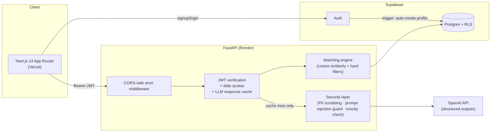

# 🏠 RentSafe

**The renter-safety platform for students — analyze your lease, detect rental scams, know your rights, and find a compatible roommate. All in one place.**

Rental scam reports targeting students rose 22% in 2025, and international students wiring deposits to fake landlords are the most common victims. RentSafe puts an AI safety layer between students and the rental market.

<!-- 🔗 Live demo: ADD_VERCEL_URL_HERE • 🎬 Demo video: ADD_GIF_HERE -->

## Features

| | Feature | What it does |
|---|---|---|
| 📄 | **Lease Analyzer** | Upload a lease PDF → plain-English summary, red-flag clauses with risk levels, negotiation tips, and a tenant-friendliness score |
| 🚨 | **Scam Detector** | Paste any listing → 0–100 scam score, specific red flags, hidden-fee estimates, and safety tips |
| ⚖️ | **Tenant Rights Bot** | State-specific answers to renter questions, with a hallucination guard that refuses rather than guesses |
| 🤝 | **Roommate Matcher** | Post a space or seek one → cosine-similarity matching over lifestyle vectors, with an explainable factor-by-factor breakdown of *why* you matched |
| 💬 | **Match Chat** | Built-in messaging between matched users — no phone numbers shared, toxicity-filtered |
| 🎓 | **Student Verification** | `.edu` accounts get a verified-student badge |

## Architecture



## Engineering highlights

- **Cost-bounded AI** — every LLM endpoint requires a verified login, enforces per-user daily quotas (atomic Postgres `RPC` counter), and serves repeated inputs from a response cache. Worst-case daily spend is a known formula, not a surprise.
- **Explainable matching** — roommate compatibility is an 11-dimensional lifestyle vector (cleanliness, noise, guests, schedule, smoking, budget, must-haves) scored with cosine similarity behind hard city/budget filters; the API returns a per-factor breakdown so users see *why* they matched.
- **Defense in depth** — Postgres row-level security with per-table policies, a trusted service-role backend, PII scrubbing (Presidio) before lease text reaches the LLM, prompt-injection delimiters on user input, and regex toxicity gating on all user-generated content.
- **Honest errors** — custom middleware returns unhandled exceptions as CORS-safe JSON, so the frontend always shows the real failure instead of an opaque "Failed to fetch".
- **LLM reliability** — structured outputs parsed into Pydantic schemas; the rights bot is prompted to refuse rather than invent statutes.

## Stack

Next.js 14 · TypeScript · Tailwind — FastAPI · Pydantic · scikit-learn · Presidio — Supabase (Postgres, Auth, RLS) — OpenAI structured outputs

## Run it locally

```bash
# 1. Supabase: run database/schema.sql, rls_policies.sql, api_protection.sql

# 2. Backend (Python 3.12)
cd backend
pip install -r requirements.txt
cp .env.example .env   # fill in OpenAI + Supabase keys
uvicorn main:app --reload

# 3. Frontend
cd frontend
npm install
cp .env.local.example .env.local   # fill in Supabase URL + publishable key
npm run dev
```

Seed demo data and verify everything:

```bash
cd backend
python scripts/seed_demo.py     # 4 demo users + matching posts
python scripts/smoke_test.py    # checks every endpoint
```

## Deployment

Runs free on Vercel (frontend) + Render (`render.yaml`) + Supabase. Full guide: [DEPLOY.md](DEPLOY.md).

## Roadmap

Campus-distance matching for space posts · listing-URL scam checks · international-student onboarding · Realtime chat via Supabase channels

---

Built by [Yachi Darji](https://www.linkedin.com/) — Illinois Institute of Technology
